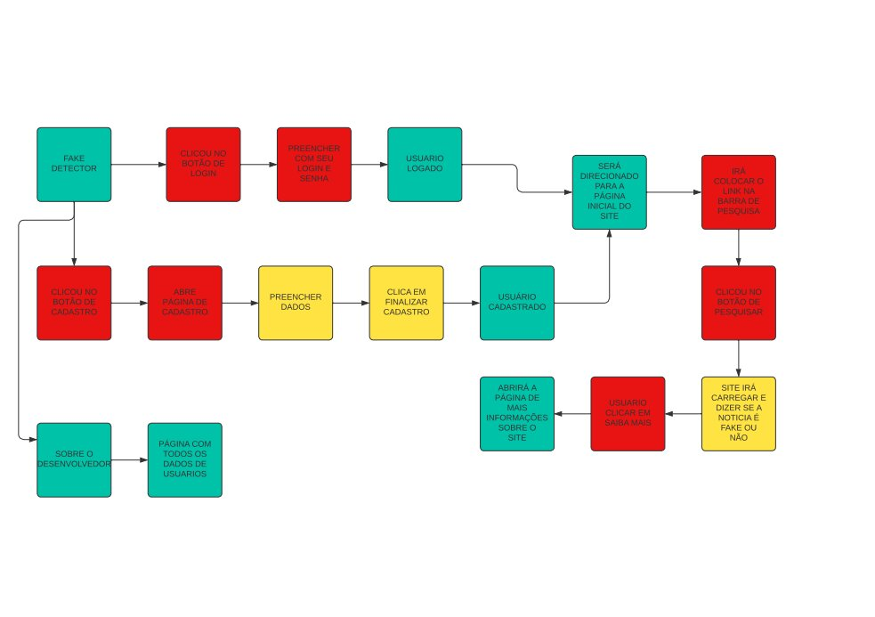
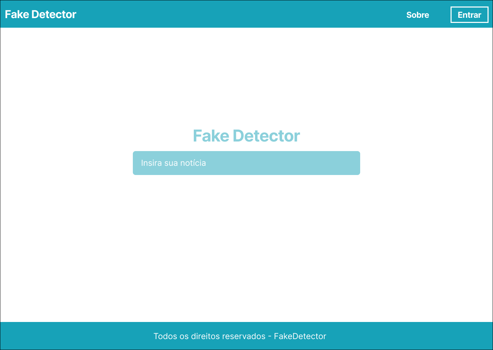
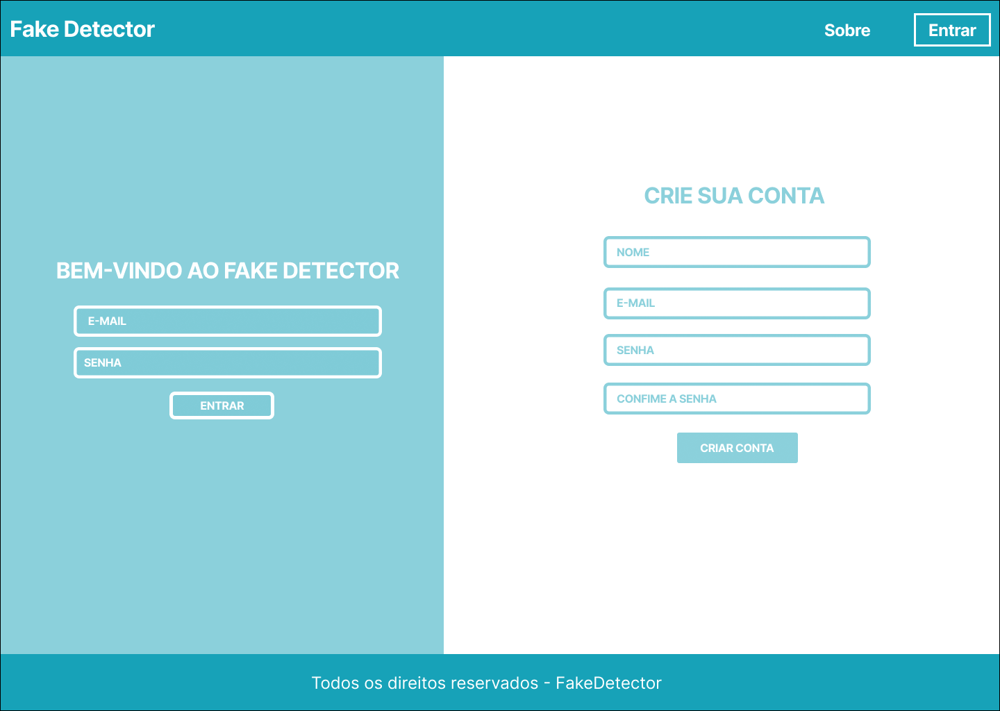
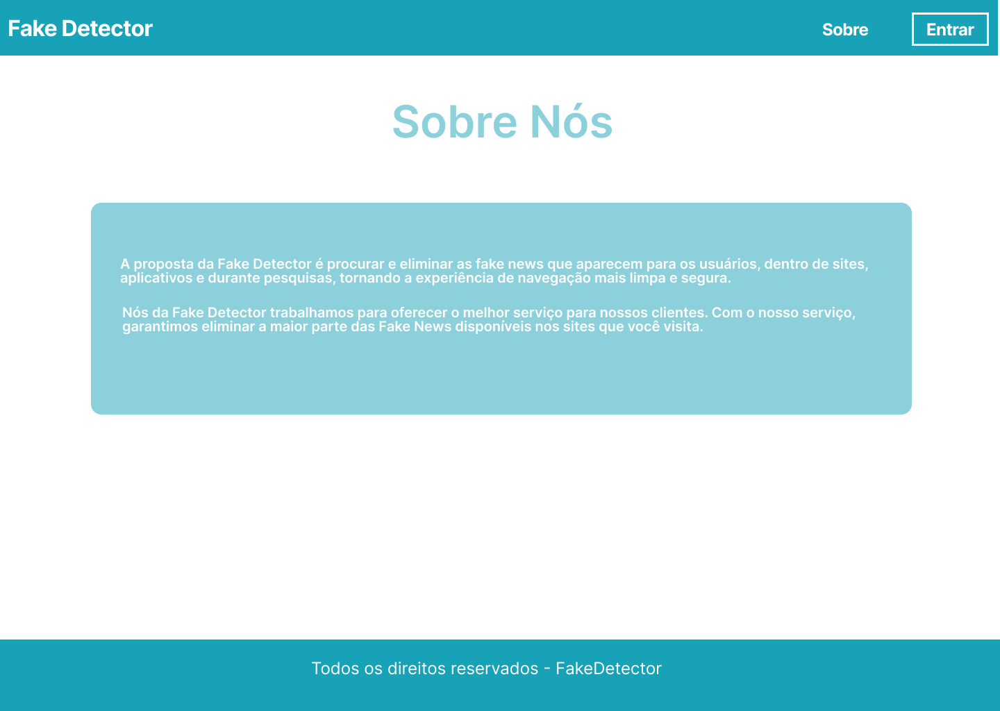
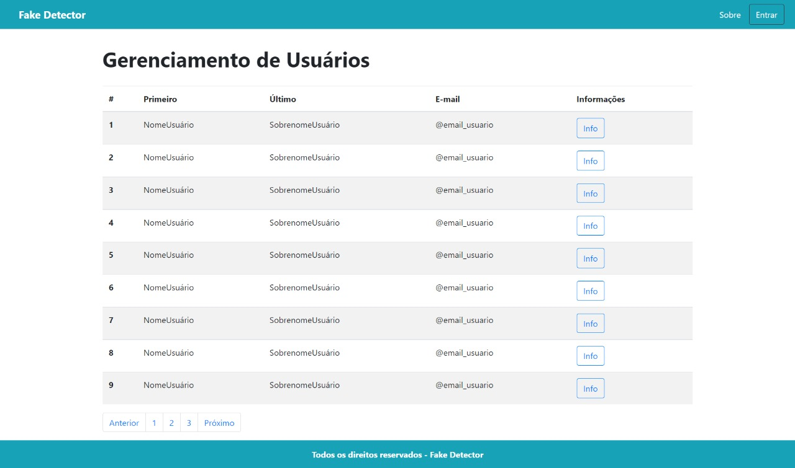

# Diagrama de Caso de Uso

 O objetivo do diagrama de caso de uso em é demonstrar as diferentes maneiras que o usuário pode interagir com um sistema.
 O diagrama de caso de uso é ideal para:

Representar as metas de interações entre sistemas e usuários

. Definir e organizar requisitos funcionais no sistema

. Especificar o contexto e os requisitos do sistema

. Modelar o fluxo básico de eventos no caso de uso

## User Flow

## Wireframes

## Wireframe - Principal 

## Wireframe - Cadastro/Login 

## Wireframe - Sobre nós 

## Wireframe - Gerenciador de Usuários 

 

